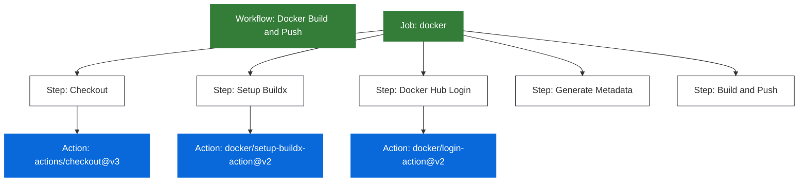

# Budowanie i Publikowanie Obrazów Docker z GitHub Actions

## Wymagania

- Konto na GitHub
- Git zainstalowany lokalnie

## Cel

Celem jest zbudowanie pipeline'u w GitHub Actions, który automatycznie buduje i publikuje obrazy Docker do Docker Hub.

Pipeline powinien spełniać następujące wymagania:
- Uruchamiać się przy commitach do `main` - a więc po domknięciu Pull Requesty
- Budować obraz kontenera i tagować w oparciu o commit i datę merge'a
- Format tagu powinien zawierać pierwsze 8 znaków hasha commita oraz datę (yyyy-MM-dd)
- Przesyłać zbudowany obraz do rejestru Docker Hub

Zajrzyj do [dokumentacji GitHub Actions](https://docs.github.com/en/actions), aby dowiedzieć się więcej.

## Krok 0 - Fork repozytorium

Wykonaj fork tego repozytorium (przycisk "Fork" w prawym górnym rogu).

> Więcej o forkowaniu w [dokumentacji GitHub](https://docs.github.com/en/get-started/quickstart/fork-a-repo).

Sklonuj repozytorium na swój komputer lub cloud shell.

> Jeżeli już posiadasz fork tego repozytorium dla innego zadania, możesz nowemu nadać nową nazwę, np. `basiccicd-artefakty`.

```bash
git clone https://github.com/your-username/basiccicd
cd basiccicd
```

## Krok 1 - Konfiguracja Docker Hub

1. Utwórz konto na [Docker Hub](https://hub.docker.com/)
   1. Możesz podać adres mail uczelni
   2. Zweryfikuj konto klikając na link w mailu, nie musisz wypełniać dodatkowych danych
2. Utwórz nowe repozytorium na [Docker Hub](https://hub.docker.com/):
   - Kliknij "Create Repository"
   - Nazwij repozytorium `weather-app`
   - Ustaw widoczność na _public_
   - Kliknij "Create"
3. Utwórz token dostępu dla GitHub Actions:
   - W prawym górnym znajdź menu z ustawieniami konta, Przejdź do Account Settings
   - W lewym menu wybierz "Personal access tokens"
   - Dodaj opis (np. "GitHub Actions")
   - Ustaw expiration date na 30 dni
   - Ustaw uprawnienia na `Read & Write` i kliknij Generate
   - Skopiuj token (będzie pokazany tylko raz!)

## Krok 2 - Konfiguracja Sekretów GitHub

Dodaj dane uwierzytelniające Docker Hub do GitHub Secrets:

1. Przejdź do swojego repozytorium na GitHub
2. Nawiguj do Settings > Secrets and variables > Actions
3. Dodaj nowe sekrety repozytorium:
   - `DOCKERHUB_USERNAME`: Twoja nazwa użytkownika Docker Hub
   - `DOCKERHUB_TOKEN`: Token dostępu, który utworzyłeś

## Krok 3 - Konfiguracja Zmiennych Środowiskowych GitHub

Dodaj zmienną środowiskową dla nazwy repozytorium Docker:

1. Przejdź do swojego repozytorium na GitHub
2. Nawiguj do Settings > Secrets and variables > Actions
3. Przejdź do zakładki "Variables"
4. Kliknij "New repository variable"
5. Dodaj nową zmienną:
   - Name: `DOCKER_REPOSITORY_NAME`
   - Value: nazwa-twojego-repozytorium (np. "weather-app")
   - Kliknij "Add variable"

Ta zmienna będzie używana w workflow do określenia nazwy repozytorium Docker Hub.

## Krok 4 - Tworzenie Workflow

Utwórz nowy branch:

```bash
git checkout -b artifacts-with-dockerhub
```

Utwórz plik `.github/workflows/cd-dockerhub.yml` i postępuj zgodnie z poniższymi krokami.  

Po każdym kroku wykonaj commit i push do repozytorium:

```bash
git add .
git commit -m "Add Docker workflow"
git push
```

### 3.1 Dodaj trigger

```yaml
name: Container image build and push

on:
  push:
    branches: [ master ]
```

### 3.2 Dodaj Job Budowania Docker

Utwórz job, który będzie:
- Pobierał kod
- Konfigurował Docker Buildx
- Logował się do Docker Hub


Sekcja poniżej odpowiada za logowanie się do docker hub oraz uruchomienie buildu. Zauważ, że nie podajesz żadnej ścieżki do pliku.

```yaml
jobs:
  docker:
    name: Build and Push Docker Image
    runs-on: ubuntu-latest
    steps:
      - name: Checkout code
        uses: actions/checkout@v4

      - name: Set up Docker Buildx
        uses: docker/setup-buildx-action@v3

      - name: Login to Docker Hub
        uses: docker/login-action@v3
        with:
          username: ${{ secrets.DOCKERHUB_USERNAME }}
          password: ${{ secrets.DOCKERHUB_TOKEN }}
```

Sekcja poniżej odpowiada za wygenerowanie taga, składającego się z fragmentu commit hasha i bieżącej daty.
  
```yaml
      - name: Generate image metadata
        id: meta
        run: |
          echo "DATE=$(date +'%Y-%m-%d')" >> $GITHUB_ENV
          echo "SHA=$(git rev-parse --short=8 HEAD)" >> $GITHUB_ENV

      - name: Build and push
        uses: docker/build-push-action@v6
        with:
          context: .
          push: true
          tags: ${{ secrets.DOCKERHUB_USERNAME }}/${{ vars.DOCKER_REPOSITORY_NAME }}:${{ env.SHA }}-${{ env.DATE }}
```

## Krok 5 - Testowanie Workflow

1. Wykonaj commit:
```bash
git add .
git commit -m "Add Docker workflow"
git push
```

2. Stwórz pull request i go zmerge'uj.

1. Przejdź do zakładki GitHub Actions, aby monitorować workflow
2. Po pomyślnym zakończeniu, sprawdź swoje repozytorium Docker Hub w poszukiwaniu nowego obrazu

## Krok 6 - Weryfikacja Wymagań

Upewnij się, że Twój workflow:
- [x] Uruchamia się przy push do gałęzi master
- [x] Poprawnie buduje obraz Docker
- [x] Taguje obraz hashem commita i datą
- [x] Przesyła obraz do Docker Hub

Twój potok jest teraz gotowy do automatycznego budowania i publikowania obrazów Docker!

## Struktura Workflow



Diagram pokazuje:
- Workflow zawiera jeden job: `docker`
- Każdy krok wykorzystuje specyficzne GitHub Actions
- Przepływ od pobrania kodu do przesłania obrazu
- Integrację z Docker Hub poprzez sekrety

> Więcej szczegółów na temat struktury workflow GitHub Actions znajdziesz w [oficjalnej dokumentacji](https://docs.github.com/en/actions/learn-github-actions/understanding-github-actions)
