# Wdrażanie Aplikacji na Kubernetes z GitHub Actions

## Wymagania

- Konto na GitHub
- Konto Azure z aktywną subskrypcją
- Git zainstalowany lokalnie
- Azure CLI (opcjonalnie)

## Cel

Celem jest zbudowanie kompletnego pipeline'u CI/CD w GitHub Actions, który:
- Buduje aplikację NodeJS
- Tworzy obraz Docker
- Publikuje obraz w Azure Container Registry
- Wdraża aplikację na klaster Kubernetes w Azure

## Krok 0 - Przygotowanie Infrastruktury

1. Postępuj zgodnie z instrukcją w dokumencie [README-infra.md](README-infra.md), aby utworzyć wymaganą infrastrukturę w Azure, w tym klaster AKS i Azure Container Registry.

2. Po utworzeniu infrastruktury, sprawdź połączenie z klastrem Kubernetes:

```bash
az aks get-credentials --name <nazwa-klastra> --resource-group <nazwa-resource-group>
kubectl get nodes
```

## Krok 1 - Konfiguracja Poświadczeń Azure w GitHub

1. Utwórz Service Principal z dostępem do ACR i AKS:

```bash
az ad sp create-for-rbac --name "github-actions-sp" --role contributor \
                         --scopes /subscriptions/<ID-SUBSKRYPCJI>/resourceGroups/<NAZWA-RESOURCE-GROUP> \
                         --sdk-auth
```

2. Przejdź do swojego repozytorium na GitHub
3. Nawiguj do Settings > Secrets and variables > Actions
4. Dodaj nowe sekrety repozytorium:
   - `AZURE_CREDENTIALS`: Dane JSON z poprzedniego kroku
   - `AZURE_REGISTRY_NAME`: Nazwa rejestru kontenerów (bez .azurecr.io)
   - `AZURE_CLUSTER_NAME`: Nazwa klastra AKS
   - `AZURE_RESOURCE_GROUP`: Nazwa grupy zasobów
   - `WEATHER_API_KEY`: Klucz API dla aplikacji pogodowej

## Krok 2 - Tworzenie Workflow

Utwórz nowy branch:

```bash
git checkout -b k8s-deployment
```

Utwórz plik `.github/workflows/cd-kubernetes.yml` z poniższą zawartością:

```yaml
name: CD Kubernetes Deployment

on:
  push:
    branches: [ main ]
  workflow_dispatch:

env:
  APP_NAME: weather-app
  REGISTRY_NAME: ${{ secrets.AZURE_REGISTRY_NAME }}
  CLUSTER_NAME: ${{ secrets.AZURE_CLUSTER_NAME }}
  RESOURCE_GROUP: ${{ secrets.AZURE_RESOURCE_GROUP }}

jobs:
  build-and-push:
    name: Build App and Push Docker Image
    runs-on: ubuntu-latest
    outputs:
      image_tag: ${{ steps.image-tag.outputs.tag }}
    steps:
      - name: Checkout code
        uses: actions/checkout@v4

#      # Node.js steps
#      - name: Setup Node.js
#        uses: actions/setup-node@v4
#        with:
#          node-version: '20'
#          cache: 'npm'
#
#      - name: Install Dependencies
#        run: npm ci
#
#      - name: Run Tests
#        run: npm test
#
#      - name: Build Application
#        run: npm run build
        
      # Metadata preparation
      - name: Get metadata
        id: meta
        run: |
          echo "sha_short=$(git rev-parse --short=8 HEAD)" >> $GITHUB_OUTPUT
          echo "date=$(date +'%Y-%m-%d')" >> $GITHUB_OUTPUT
          
      - name: Set image tag
        id: image-tag
        run: echo "tag=${{ env.REGISTRY_NAME }}.azurecr.io/${{ env.APP_NAME }}:${{ steps.meta.outputs.sha_short }}-${{ steps.meta.outputs.date }}" >> $GITHUB_OUTPUT
          
      # Azure and Docker steps
      - name: Login to Azure
        uses: azure/login@v2
        with:
          creds: ${{ secrets.AZURE_CREDENTIALS }}
          
      - name: Setup Docker Buildx
        uses: docker/setup-buildx-action@v3
          
      - name: Login to ACR
        uses: docker/login-action@v3
        with:
          registry: ${{ env.REGISTRY_NAME }}.azurecr.io
          username: ${{ secrets.AZURE_CLIENT_ID }}
          password: ${{ secrets.AZURE_CLIENT_SECRET }}
          
      - name: Build and Push Docker Image
        uses: docker/build-push-action@v6
        with:
          context: .
          push: true
          tags: ${{ steps.image-tag.outputs.tag }}
          cache-from: type=gha
          cache-to: type=gha,mode=max

  deploy-to-kubernetes:
    name: Deploy to Kubernetes
    needs: build-and-push
    runs-on: ubuntu-latest
    steps:
      - name: Checkout code
        uses: actions/checkout@v4
        
      - name: Login to Azure
        uses: azure/login@v2
        with:
          creds: ${{ secrets.AZURE_CREDENTIALS }}
          
      - name: Get AKS credentials
        uses: azure/aks-set-context@v3
        with:
          resource-group: ${{ env.RESOURCE_GROUP }}
          cluster-name: ${{ env.CLUSTER_NAME }}
          
      - name: Create Kubernetes namespace if not exists
        run: |
          kubectl create namespace weather-app --dry-run=client -o yaml | kubectl apply -f -
          
      - name: Create Kubernetes Secret for API Key
        run: |
          kubectl create secret generic weather-api-secret \
            --from-literal=WEATHER_API_KEY=${{ secrets.WEATHER_API_KEY }} \
            --namespace weather-app \
            --dry-run=client -o yaml | kubectl apply -f -
          
      - name: Create Kubernetes manifest files
        env:
          IMAGE_TAG: ${{ needs.build-and-push.outputs.image_tag }}
        run: |
          # Deployment
          cat > deployment.yaml <<EOF
          apiVersion: apps/v1
          kind: Deployment
          metadata:
            name: weather-app
            namespace: weather-app
            labels:
              app: weather-app
          spec:
            replicas: 2
            selector:
              matchLabels:
                app: weather-app
            template:
              metadata:
                labels:
                  app: weather-app
              spec:
                containers:
                - name: weather-app
                  image: ${IMAGE_TAG}
                  ports:
                  - containerPort: 3000
                  resources:
                    limits:
                      cpu: "500m"
                      memory: "512Mi"
                    requests:
                      cpu: "100m"
                      memory: "128Mi"
                  env:
                  - name: WEATHER_API_KEY
                    valueFrom:
                      secretKeyRef:
                        name: weather-api-secret
                        key: WEATHER_API_KEY
                  readinessProbe:
                    httpGet:
                      path: /
                      port: 3000
                    initialDelaySeconds: 10
                    periodSeconds: 5
                  livenessProbe:
                    httpGet:
                      path: /
                      port: 3000
                    initialDelaySeconds: 15
                    periodSeconds: 10
          EOF
          
          # Service
          cat > service.yaml <<EOF
          apiVersion: v1
          kind: Service
          metadata:
            name: weather-app
            namespace: weather-app
          spec:
            selector:
              app: weather-app
            ports:
            - port: 80
              targetPort: 3000
            type: ClusterIP
          EOF
          
          # Ingress
          cat > ingress.yaml <<EOF
          apiVersion: networking.k8s.io/v1
          kind: Ingress
          metadata:
            name: weather-app-ingress
            namespace: weather-app
            annotations:
              kubernetes.io/ingress.class: "azure/application-gateway"
          spec:
            rules:
            - http:
                paths:
                - path: /
                  pathType: Prefix
                  backend:
                    service:
                      name: weather-app
                      port:
                        number: 80
          EOF
          
      - name: Deploy to Kubernetes
        run: |
          kubectl apply -f deployment.yaml
          kubectl apply -f service.yaml
          kubectl apply -f ingress.yaml
          
      - name: Verify deployment
        run: |
          kubectl rollout status deployment/weather-app -n weather-app --timeout=180s
          kubectl get pods,svc,ingress -n weather-app
```

## Krok 3 - Testowanie Workflow

1. Wykonaj commit i push zmian:
```bash
git add .
git commit -m "Dodaj workflow wdrożenia na Kubernetes"
git push --set-upstream origin k8s-deployment
```

2. Utwórz Pull Request i przeprowadź merge do main
3. Przejdź do zakładki Actions w GitHub, aby monitorować postęp wdrożenia
4. Po zakończeniu wdrożenia, sprawdź status zasobów w klastrze Kubernetes:

```bash
kubectl get pods,svc,ing -n weather-app
```

## Szczegóły Implementacji

### Struktura Workflow

Workflow składa się z trzech głównych jobów:

1. **build-and-push**:
   - Buduje aplikację NodeJS
   - Uruchamia testy
   - Generuje artefakt budowania
   - Buduje obraz Docker
   - Taguje go z użyciem 8-znakowego hasha commita i daty (YYYY-MM-DD)
   - Publikuje obraz w Azure Container Registry
   - Wykorzystuje cache dla przyspieszenia budowania

2. **deploy-to-kubernetes**:
   - Tworzy przestrzeń nazw (namespace) w Kubernetes
   - Tworzy sekret dla klucza API
   - Generuje pliki manifestów Kubernetes:
     - Deployment z konfiguracją zasobów i sondami healthcheck
     - Service typu ClusterIP
     - Ingress dla dostępu zewnętrznego
   - Wdraża aplikację i weryfikuje status wdrożenia

### Zaawansowane Funkcje

1. **Zarządzanie sekretami**:
   - Klucz API jest przechowywany jako sekret Kubernetes
   - Service Principal jest przechowywany w GitHub Secrets

2. **Optymalizacja buildów**:
   - Wykorzystanie Docker Buildx i cache'owania w GitHub Actions
   - Przekazywanie tylko niezbędnych plików jako artefaktów

3. **Zarządzanie zasobami Kubernetes**:
   - Ustawienie limitów zasobów dla kontenerów
   - Konfiguracja readiness i liveness probes
   - Użycie replicas dla wysokiej dostępności

4. **Obsługa błędów**:
   - Weryfikacja statusu wdrożenia z timeoutem
   - Idempotentne tworzenie namespaces i sekretów

## Diagram Workflow

```mermaid
graph TD
    A[Workflow: CD Kubernetes] --> B[Job: build-and-push]
    A --> D[Job: deploy-to-kubernetes]
    
    B --> B1[Checkout code]
    B --> B2[Setup Node.js]
    B --> B3[Install Dependencies]
    B --> B4[Run Tests]
    B --> B5[Build Application]
    B --> B6[Get metadata]
    B --> B7[Set image tag]
    B --> B8[Login to Azure]
    B --> B9[Setup Docker Buildx]
    B --> B10[Login to ACR]
    B --> B11[Build and Push Docker Image]
    
    D --> D1[Checkout code]
    D --> D2[Login to Azure]
    D --> D3[Get AKS credentials]
    D --> D4[Create Kubernetes namespace]
    D --> D5[Create Secret for API Key]
    D --> D6[Create K8s manifests]
    D --> D7[Deploy to Kubernetes]
    D --> D8[Verify deployment]
    
    style A fill:#347d39,stroke:#347d39,color:#ffffff
    style B fill:#347d39,stroke:#347d39,color:#ffffff
    style D fill:#347d39,stroke:#347d39,color:#ffffff
    style D8 fill:#ff9900,stroke:#ff9900,color:#ffffff
```



## Najczęstsze Problemy

1. **Problem z poświadczeniami**: Upewnij się, że Service Principal ma odpowiednie uprawnienia do ACR i AKS.
2. **Błędy budowania**: Sprawdź logi w GitHub Actions, aby zobaczyć szczegóły błędów.
3. **Problemy z Ingress**: Sprawdź, czy kontroler Ingress jest poprawnie zainstalowany w klastrze.
4. **Timeout podczas wdrożenia**: Może być spowodowany problemami z zasobami klastra lub błędami w konfiguracji.

## Weryfikacja Wdrożenia

Po zakończeniu wdrożenia możesz zweryfikować działanie aplikacji:

1. Znajdź adres Ingress:
```bash
kubectl get ingress weather-app-ingress -n weather-app
```

2. Otwórz przeglądarkę i przejdź pod adres podany w kolumnie ADDRESS
3. Możesz również sprawdzić logi aplikacji:
```bash
kubectl logs -l app=weather-app -n weather-app
```

## Dokumentacja

- [GitHub Actions](https://docs.github.com/en/actions)
- [Azure Kubernetes Service](https://docs.microsoft.com/en-us/azure/aks/)
- [Kubernetes Documentation](https://kubernetes.io/docs/home/)
- [Docker Buildx](https://docs.docker.com/engine/reference/commandline/buildx/)
