# Wdrażanie Aplikacji na Kubernetes z GitHub Actions

## Wymagania

- Konto na GitHub
- Konto Azure z aktywną subskrypcją
- Git zainstalowany lokalnie
- Azure CLI (opcjonalnie)

## Cel

Celem jest zbudowanie kompletnego pipeline'u CI/CD w GitHub Actions, który:
- Buduje aplikację NodeJS
- Tworzy obraz Docker
- Publikuje obraz w Azure Container Registry
- Wdraża aplikację na klaster Kubernetes w Azure

## Krok 0 - Przygotowanie Infrastruktury

1. Postępuj zgodnie z instrukcją w dokumencie [README-infra.md](README-infra.md), aby utworzyć wymaganą infrastrukturę w Azure, w tym klaster AKS i Azure Container Registry.

2. Po utworzeniu infrastruktury, sprawdź połączenie z klastrem Kubernetes:

```bash
RG_NAME=<nazwa-resource-group>
AKS_NAME=<nazwa-clustra>

az aks get-credentials --name $AKS_NAME --resource-group $RG_NAME

kubectl get nodes
```

## Krok 1 - Konfiguracja Poświadczeń Azure w GitHub

1. Utwórz Service Principal z dostępem do ACR i AKS:

> Te poświadczenia dostaniesz od prowadzącego!

```bash
az ad sp create-for-rbac --name "github-actions-sp" --role contributor \
                         --scopes /subscriptions/<ID-SUBSKRYPCJI>/resourceGroups/<NAZWA-RESOURCE-GROUP>
```

1. Przejdź do swojego repozytorium na GitHub
2. Nawiguj do Settings > Secrets and variables > Actions
3. Dodaj nowe sekrety:
   - `AZURE_CREDENTIALS`: Dane JSON z poprzedniego kroku
   - `WEATHER_API_KEY`: Klucz API dla aplikacji pogodowej
   - `ACR_USERNAME`: Zawartość `Username`, które znajdziesz na poziomie ACR > Settings > Access keys
   - `ACR_PASSWORD`: Zawartość `password`, które znajdziesz na poziomie ACR > Settings > Access keys
4. Dodaj nowe zmienne:
   - `AZURE_REGISTRY_NAME`: Nazwa rejestru kontenerów (bez .azurecr.io)
   - `AZURE_CLUSTER_NAME`: Nazwa klastra AKS
   - `AZURE_RESOURCE_GROUP`: Nazwa grupy zasobów


## Krok 2 - Tworzenie zasobów i konfiguracja kubernetes

- Podłącz ACR do Kubernetes

```bash
RG_NAME=<nazwa-resource-group>
AKS_NAME=<nazwa-clustra>
ACR_NAME=<nazwa acr>

az aks update --name $AKS_NAME --resource-group $RG_NAME --attach-acr $ACR_NAME
```

- Stwórz zasoby wewnątrz kubernetesa:

```bash
kubectl apply -f infra/weather_app_manifests/namespace.yaml
kubectl apply -f infra/weather_app_manifests/secret.yaml
kubectl apply -f infra/weather_app_manifests/deployment.yaml
kubectl apply -f infra/weather_app_manifests/secret.yaml
kubectl apply -f infra/weather_app_manifests/service.yaml
kubectl apply -f infra/weather_app_manifests/ingress.yaml
```

## Krok 3 - Skonfigurowanie dostępu ACR do klastra Kubernetes

```bash
$ACR_NAME=<nazwa ACR>
az aks update --name $AKS_NAME --resource-group $RG_NAME --attach-acr $ACR_NAME
```

## Krok 4 - Tworzenie Workflow

Utwórz nowy branch:

```bash
git checkout -b k8s-deployment
```

Utwórz plik `.github/workflows/cd-kubernetes.yml` z poniższą zawartością:

```yaml
name: CD Kubernetes Deployment

on:
  pull_request:
    branches: [ main ]
  push:
    branches: [ main ]
  workflow_dispatch:

env:
  APP_NAME: weather-app
  REGISTRY_NAME: ${{ vars.AZURE_REGISTRY_NAME }}
  CLUSTER_NAME: ${{ vars.AZURE_CLUSTER_NAME }}
  RESOURCE_GROUP: ${{ vars.AZURE_RESOURCE_GROUP }}

permissions:
  id-token: write
  contents: read
  actions: read

jobs:
  build-and-push:
    name: Build and Push Docker Image
    runs-on: ubuntu-latest
    outputs:
      image_tag: ${{ steps.image-tag.outputs.tag }}
    steps:
      - name: Checkout code
        uses: actions/checkout@v4

      - name: Get metadata
        id: meta
        run: |
          echo "sha_short=$(git rev-parse --short=8 HEAD)" >> $GITHUB_OUTPUT
          echo "date=$(date +'%Y-%m-%d')" >> $GITHUB_OUTPUT
          
      - name: Set image tag
        id: image-tag
        run: echo "tag=${{ env.REGISTRY_NAME }}.azurecr.io/${{ env.APP_NAME }}:${{ steps.meta.outputs.sha_short }}-${{ steps.meta.outputs.date }}" >> $GITHUB_OUTPUT
          
      - name: Login to Azure
        uses: azure/login@v2
        with:
          creds: ${{ secrets.AZURE_CREDENTIALS }}
          
      - name: Setup Docker Buildx
        uses: docker/setup-buildx-action@v3
          
      - name: Login to ACR
        uses: docker/login-action@v3
        with:
          registry: ${{ env.REGISTRY_NAME }}.azurecr.io
          username: ${{ secrets.ACR_USERNAME }}
          password: ${{ secrets.ACR_PASSWORD }}
          
      - name: Build and Push Docker Image
        uses: docker/build-push-action@v6
        with:
          context: .
          push: true
          tags: ${{ steps.image-tag.outputs.tag }}

      - name: Store image name
        run: |
          echo "${{ steps.image-tag.outputs.tag }}" >> tag.txt

      - name: Upload artifact
        uses: actions/upload-artifact@v4
        with:
          name: tag
          path: tag.txt
          retention-days: 1

  deploy-to-kubernetes:
    name: Deploy to Kubernetes
    needs: build-and-push
    runs-on: ubuntu-latest
    steps:
      - name: Checkout code
        uses: actions/checkout@v4

      - name: Download artifact
        uses: actions/download-artifact@v4
        with:
          name: tag
          path: .
        
      - name: Read image tag
        id: image-tag
        run: echo "IMAGE_TAG=$(cat tag.txt)" >> $GITHUB_OUTPUT
        
      - name: Login to Azure
        uses: azure/login@v2
        with:
          creds: ${{ secrets.AZURE_CREDENTIALS }}
          
      - name: Get AKS credentials
        uses: azure/aks-set-context@v3
        with:
          resource-group: ${{ env.RESOURCE_GROUP }}
          cluster-name: ${{ env.CLUSTER_NAME }}
      
      - name: Setup kubectl
        uses: azure/setup-kubectl@v4
          
      - name: Deploy to Kubernetes
        uses: Azure/k8s-deploy@v5
        with:
          action: deploy
          namespace: weather-app
          manifests: |
            infra/weather_app_manifests/deployment.yaml
          images: |
            ${{ steps.image-tag.outputs.IMAGE_TAG }}
          
      - name: Verify deployment
        run: |
          kubectl get pods,svc,ingress -n weather-app
```

## Krok 5 - Testowanie Workflow

1. Wykonaj commit i push zmian:
```bash
git add .
git commit -m "Dodaj workflow wdrożenia na Kubernetes"
git push --set-upstream origin k8s-deployment
```

2. Utwórz Pull Request i przeprowadź merge do main
3. Przejdź do zakładki Actions w GitHub, aby monitorować postęp wdrożenia
4. Po zakończeniu wdrożenia, sprawdź status zasobów w klastrze Kubernetes:

```bash
kubectl get pods,svc,ing -n weather-app
```

W wynikach znajdziesz m.in adres IP, otwórz stronę i zobacz czy widzisz Weather App.

## Krok 6 Przygotuj obrazy blue/green deployment

- stwórz nowy branch `k8s-blue-green`

- Pobierz obraz blue
  
  Pobierz nazwę obrazu z pipeline, ACR lub przez podejrzenie definicji deploymentu:  

  ```bash
  kubectl get deployment -n weather-app -o=jsonpath='{.items[0].spec.template.spec.containers[0].image}'
  ```

- Podmień definicję kolorów 

  ```bash
  # W katalogu projektu
  cp public/styles-green.css public/styles.css
  
  git add public/styles.css
  
  git commit -m "Aktualizacja stylu na wersję Green"
  
  git push
  ```

- Stwórz pull request. Zauważ, że zmiana spowoduje automatyczne wdrożenie na środowisko - przerwij flow zaraz po zbudowaniu obrazu
- Pobierz nazwę obrazu green - poznasz ją po commit hash

## Krok 7 Przygotuj zasoby kubernetes pod blue/green
  
 - w plikach 
    - `infra/weather_app_manifests/deployment-blue.yaml`
    - `infra/weather_app_manifests/deployment-green.yaml`  
   zmień nazwy obrazów na właściwe

- wdróż zasoby kubernetes

  ```bash
  kubectl apply -f infra/weather_app_manifests/deployment-blue.yaml
  kubectl apply -f infra/weather_app_manifests/deployment-green.yaml
  kubectl apply -f infra/weather_app_manifests/service-blue-green.yaml
  kubectl apply -f infra/weather_app_manifests/ingress-blue-green.yaml
  kubectl apply -f infra/weather_app_manifests/service-green-test.yaml
  ```

- zweryfikuj czy aplikacja jest wdrożona

```bash
kubectl get pods -n weather-app -l version=blue

kubectl get pods -n weather-app -l version=green
```

_- zweryfikuj `<IP>/green` czy widzisz aplikację we właściwej wersji i czy działa - krok nie działa!_

- Lub zrób port forward (tylko lokalna maszyna):

```bash
kubectl -n weather-app port-forward svc/weather-app-green-test 8080:80
```

## Krok 8 Wskaż na green deployment

- przełącz wskazanie na service

```bash
kubectl patch service weather-app-blue-green -n weather-app -p '{"spec":{"selector":{"version":"green"}}}'
```

- zeskaluj pody blue

```bash
kubectl -n weather-app scale deployment weather-app blue --replicas=0
```

## Krok 9 Zasymuluj canary deployment

- wskaż na service zarówno blue, jak i green
- zeskaluj liczbę podów w green do 1, a w blue wyskaluj do 4

## Szczegóły Implementacji

### Struktura Workflow

Workflow składa się z trzech głównych jobów:

1. **build-and-push**:
   - Buduje aplikację NodeJS
   - Uruchamia testy
   - Generuje artefakt budowania
   - Buduje obraz Docker
   - Taguje go z użyciem 8-znakowego hasha commita i daty (YYYY-MM-DD)
   - Publikuje obraz w Azure Container Registry
   - Wykorzystuje cache dla przyspieszenia budowania

2. **deploy-to-kubernetes**:
   - Tworzy przestrzeń nazw (namespace) w Kubernetes
   - Tworzy sekret dla klucza API
   - Generuje pliki manifestów Kubernetes:
     - Deployment z konfiguracją zasobów i sondami healthcheck
     - Service typu ClusterIP
     - Ingress dla dostępu zewnętrznego
   - Wdraża aplikację i weryfikuje status wdrożenia

### Zaawansowane Funkcje

1. **Zarządzanie sekretami**:
   - Klucz API jest przechowywany jako sekret Kubernetes
   - Service Principal jest przechowywany w GitHub Secrets

2. **Optymalizacja buildów**:
   - Wykorzystanie Docker Buildx i cache'owania w GitHub Actions
   - Przekazywanie tylko niezbędnych plików jako artefaktów

3. **Zarządzanie zasobami Kubernetes**:
   - Ustawienie limitów zasobów dla kontenerów
   - Konfiguracja readiness i liveness probes
   - Użycie replicas dla wysokiej dostępności

4. **Obsługa błędów**:
   - Weryfikacja statusu wdrożenia z timeoutem
   - Idempotentne tworzenie namespaces i sekretów

## Diagram Workflow

```mermaid
graph TD
    A[Workflow: CD Kubernetes] --> B[Job: build-and-push]
    A --> D[Job: deploy-to-kubernetes]
    
    B --> B1[Checkout code]
    B --> B2[Setup Node.js]
    B --> B3[Install Dependencies]
    B --> B4[Run Tests]
    B --> B5[Build Application]
    B --> B6[Get metadata]
    B --> B7[Set image tag]
    B --> B8[Login to Azure]
    B --> B9[Setup Docker Buildx]
    B --> B10[Login to ACR]
    B --> B11[Build and Push Docker Image]
  
    D --> D1[Checkout code]
    D --> D2[Login to Azure]
    D --> D3[Get AKS credentials]
    D --> D4[Apply namespace]
    D --> D5[Create Secret for API Key]
    D --> D6[Set image in deployment manifest]
    D --> D7[Deploy to Kubernetes]
    D --> D8[Verify deployment]
    
    style A fill:#347d39,stroke:#347d39,color:#ffffff
    style B fill:#347d39,stroke:#347d39,color:#ffffff
    style D fill:#347d39,stroke:#347d39,color:#ffffff
    style D8 fill:#ff9900,stroke:#ff9900,color:#ffffff
```



## Najczęstsze Problemy

1. **Problem z poświadczeniami**: Upewnij się, że Service Principal ma odpowiednie uprawnienia do ACR i AKS.
2. **Błędy budowania**: Sprawdź logi w GitHub Actions, aby zobaczyć szczegóły błędów.
3. **Problemy z Ingress**: Sprawdź, czy kontroler Ingress jest poprawnie zainstalowany w klastrze.
4. **Timeout podczas wdrożenia**: Może być spowodowany problemami z zasobami klastra lub błędami w konfiguracji.

## Weryfikacja Wdrożenia

Po zakończeniu wdrożenia możesz zweryfikować działanie aplikacji:

1. Znajdź adres Ingress:
```bash
kubectl get ingress weather-app-ingress -n weather-app
```

2. Otwórz przeglądarkę i przejdź pod adres podany w kolumnie ADDRESS
3. Możesz również sprawdzić logi aplikacji:
```bash
kubectl logs -l app=weather-app -n weather-app
```

## Dokumentacja

- [GitHub Actions](https://docs.github.com/en/actions)
- [Azure Kubernetes Service](https://docs.microsoft.com/en-us/azure/aks/)
- [Kubernetes Documentation](https://kubernetes.io/docs/home/)
- [Docker Buildx](https://docs.docker.com/engine/reference/commandline/buildx/)
