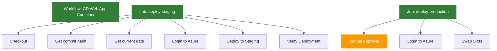

# Wdrażanie Aplikacji Kontenerowej na Azure Web App z GitHub Actions

## Wymagania

- Konto na GitHub
- Konto Azure z aktywną subskrypcją
- Git zainstalowany lokalnie
- Azure CLI
- Zbudowany obraz Docker w Docker Hub (zgodnie z README-artefakty.md)

## Cel

Celem jest zbudowanie pipeline'u w GitHub Actions, który automatycznie wdraża aplikację kontenerową na Azure Web App z wykorzystaniem `deployment slots`.

Pipeline powinien spełniać następujące wymagania:
- Uruchamiać się przy commitach do `main`
- Wdrażać obraz kontenera do slotu "staging"
- Wykonywać walidację działania aplikacji
- Umożliwiać ręcznie zatwierdzenie przed przełączeniem na produkcję
- Wykonywać swap slotów (staging -> production)

## Krok 0 - Przygotowanie Infrastruktury

1. Upewnij się, że obraz Docker został już zbudowany i opublikowany w Docker Hub zgodnie z [README-artefakty.md](README-artefakty.md).

1. Postępuj zgodnie z instrukcją w dokumencie [README-infra.md](README-infra.md), aby utworzyć wymaganą infrastrukturę w Azure.

2. Po utworzeniu infrastruktury, dodaj slot deploymentu "staging" do Azure Web App:

```bash
RG_NAME=<nazwa-resource-group>
WEBAPP_NAME=<nazwa-webapp>
az webapp deployment slot create \
  --name $WEBAPP_NAME \
  --resource-group $RG_NAME \
  --slot staging
```

3. Upewnij się, że Azure Web App jest skonfigurowana do pracy z kontenerami Docker.

## Krok 1 - Konfiguracja Sekretów GitHub

1. Przejdź do swojego repozytorium na GitHub
2. Nawiguj do Settings > Secrets and variables > Actions > Secrets
3. Dodaj nowe sekrety:
   - `AZURE_CREDENTIALS`: Dane uwierzytelniające do Azure (uzyskane przez `az ad sp create-for-rbac` albo od prowadzącego):
      ```json
      {
        "clientSecret":  "xx",
        "subscriptionId":  "twoje-id-subskrypcji",
        "tenantId":  "32268039-35b0-4dc1-961a-989ebea1bcae",
        "clientId":  "yy"
      }
      ```

   - `DOCKERHUB_USERNAME`: Twoja nazwa użytkownika Docker Hub

4. Przejdź do Settings > Secrets and variables > Actions > Variables
4. Dodaj zmienne środowiskowe: 
   - Dodaj `DOCKER_REPOSITORY_NAME`: Nazwa repozytorium Docker Hub (np. "weather-app")
   - `AZURE_WEBAPP_NAME`: Nazwa twojej Azure Web App
   - `AZURE_RESOURCE_GROUP`: Nazwa grupy zasobów

## Krok 2 - Tworzenie Workflow

Utwórz nowy branch:

```bash
git checkout -b cd-webapp-deployment
```

Utwórz plik `.github/workflows/cd-webapp.yml` i postępuj zgodnie z poniższymi krokami.

### 2.1 Dodaj Trigger i Konfigurację Środowiska

```yaml
name: CD Web App Deployment

on:
  push:
    branches: [ main ]

```

### 2.2 Dodaj Job Wdrażania

```yaml
jobs:
  deploy-staging:
    name: Deploy to Staging
    runs-on: ubuntu-latest
    steps:
      - name: Checkout code
        uses: actions/checkout@v4
        
      - name: Generate image metadata
        id: meta
        run: |
          echo "DATE=$(date +'%Y-%m-%d')" >> $GITHUB_ENV
          echo "SHA=$(git rev-parse --short=8 HEAD)" >> $GITHUB_ENV
        
      - name: Login to Azure
        uses: azure/login@v2
        with:
          creds: ${{ secrets.AZURE_CREDENTIALS }}
          
      - name: Deploy container to staging slot
        uses: azure/webapps-deploy@v3
        with:
          app-name: ${{ vars.AZURE_WEBAPP_NAME }}
          slot-name: 'staging'
          images: ${{ secrets.DOCKERHUB_USERNAME }}/${{ vars.DOCKER_REPOSITORY_NAME }}:${{ env.SHA }}-${{ env.DATE }}

      - name: Verify deployment
        run: |
          sleep 30  # czekaj na start aplikacji
          STAGING_URL="https://${{ vars.AZURE_WEBAPP_NAME }}-staging.azurewebsites.net"
          HTTP_STATUS=$(curl -s -o /dev/null -w "%{http_code}" $STAGING_URL)
          if [ $HTTP_STATUS -ne 200 ]; then
            echo "Deployment verification failed!"
            exit 1
          fi

  deploy-production:
    name: Deploy to Production
    needs: deploy-staging
    runs-on: ubuntu-latest
    steps:
      - name: Wait for approval
        uses: trstringer/manual-approval@v1
        with:
          secret: ${{ github.TOKEN }}
          approvers: wguzik
          minimum-approvals: 1
          message: 'Czy chcesz wdrożyć na produkcję?'

      - name: Login to Azure
        uses: azure/login@v2
        with:
          creds: ${{ secrets.AZURE_CREDENTIALS }}

      - name: Swap slots
        run: |
          az webapp deployment slot swap \
            --name ${{ vars.AZURE_WEBAPP_NAME }} \
            --resource-group ${{ vars.AZURE_RESOURCE_GROUP }} \
            --slot staging \
            --target-slot production
```

## Krok 3 - Testowanie Workflow

1. Upewnij się, że obraz Docker został już zbudowany i opublikowany w Docker Hub zgodnie z [README-artefakty.md](README-artefakty.md).

2. Wykonaj commit i push zmian:
```bash
git add .
git commit -m "Add Web App container deployment workflow"
git push --set-upstream origin cd-webapp-deployment
```

3. Utwórz Pull Request i przeprowadź merge do main
4. Przejdź do zakładki Actions w GitHub, aby monitorować postęp wdrożenia
5. Po wdrożeniu do slotu staging, zweryfikuj działanie aplikacji
6. Zatwierdź wdrożenie na produkcję w interfejsie GitHub Actions

## Struktura Workflow



## Weryfikacja Wymagań

Upewnij się, że Twój workflow:
- [ ] Uruchamia się przy push do main
- [ ] Wdraża obraz kontenera na slot staging
- [ ] Weryfikuje działanie aplikacji
- [ ] Wymaga manualnej akceptacji
- [ ] Wykonuje swap slotów

## Najczęstsze Problemy

1. **Problem z uwierzytelnianiem Docker Hub**: Upewnij się, że Azure Web App ma uprawnienia do pobierania obrazów z Docker Hub.
2. **Błędy z tagami kontenera**: Upewnij się, że tag obrazu jest poprawnie generowany i zgodny z tym, co zostało opublikowane w Docker Hub.
3. **Timeout podczas weryfikacji**: Dostosuj czas oczekiwania na start aplikacji kontenerowej.
4. **Problemy z konfiguracją kontenera**: Upewnij się, że Azure Web App jest poprawnie skonfigurowana do pracy z kontenerami.

## Dokumentacja

- [GitHub Actions](https://docs.github.com/en/actions)
- [Azure Web App for Containers](https://docs.microsoft.com/en-us/azure/app-service/configure-custom-container)
- [Deployment Slots](https://docs.microsoft.com/en-us/azure/app-service/deploy-staging-slots)