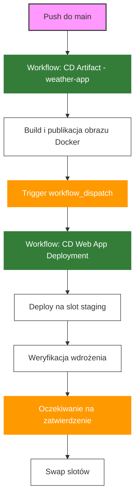

# Wdrażanie Aplikacji Kontenerowej na Azure Web App z GitHub Actions

## Wymagania

- Konto na GitHub
- Konto Azure z aktywną subskrypcją
- Git zainstalowany lokalnie
- Azure CLI
- Zbudowany obraz Docker w Docker Hub (zgodnie z README-artefakty.md)

## Cel

Celem jest zbudowanie pipeline'u w GitHub Actions, który automatycznie wdraża aplikację kontenerową na Azure Web App z wykorzystaniem `deployment slots`.

Pipeline powinien spełniać następujące wymagania:
- Uruchamiać się automatycznie po pomyślnym zbudowaniu obrazu Docker
- Wdrażać obraz kontenera do slotu "staging"
- Wykonywać walidację działania aplikacji
- Umożliwiać ręcznie zatwierdzenie przed przełączeniem na produkcję
- Wykonywać swap slotów (staging -> production)

## Krok 0 - Przygotowanie Infrastruktury

1. Upewnij się, że obraz Docker został już zbudowany i opublikowany w Docker Hub zgodnie z [README-artefakty.md](README-artefakty.md).

2. Postępuj zgodnie z instrukcją w dokumencie [README-infra.md](README-infra.md), aby utworzyć wymaganą infrastrukturę w Azure.

3. Po utworzeniu infrastruktury, dodaj slot deploymentu "staging" do Azure Web App:

```bash
RG_NAME=<nazwa-resource-group>
WEBAPP_NAME=<nazwa-webapp>
az webapp deployment slot create \
  --name $WEBAPP_NAME \
  --resource-group $RG_NAME \
  --slot staging
```

4. Upewnij się, że Azure Web App jest skonfigurowana do pracy z kontenerami Docker.

## Krok 1 - Konfiguracja GitHub

1. Przejdź do swojego repozytorium na GitHub
2. Nawiguj do Settings > Actions > General > Workflow permissions > "Read and write permissions" > Save
3. Nawiguj do Settings > Secrets and variables > Actions > Secrets
4. Dodaj nowe sekrety:
   - `AZURE_CREDENTIALS`: Dane uwierzytelniające do Azure (uzyskane przez `az ad sp create-for-rbac` albo od prowadzącego):
      ```json
      {
        "clientSecret":  "xx",
        "subscriptionId":  "twoje-id-subskrypcji",
        "tenantId":  "32268039-35b0-4dc1-961a-989ebea1bcae",
        "clientId":  "yy"
      }
      ```

   - `DOCKERHUB_USERNAME`: Twoja nazwa użytkownika Docker Hub

5. Przejdź do Settings > Secrets and variables > Actions > Variables
6. Dodaj zmienne środowiskowe: 
   - `DOCKER_REPOSITORY_NAME`: Nazwa repozytorium Docker Hub (np. "weather-app")
   - `AZURE_WEBAPP_NAME`: Nazwa twojej Azure Web App
   - `AZURE_RESOURCE_GROUP`: Nazwa grupy zasobów

## Krok 2 - Konfiguracja Wyzwalacza Między Przepływami

### 2.1 Modyfikacja cd-dockerhub.yml

Zmodyfikuj plik `.github/workflows/cd-dockerhub.yml`, aby dodać wyzwalacz dla przepływu wdrażania na Azure po pomyślnym zbudowaniu obrazu Docker:

```yaml   
      - name: Trigger deployment workflow
        if: success() && github.ref == 'refs/heads/main' && github.event_name == 'push'
        uses: actions/github-script@v6
        with:
          github-token: ${{ secrets.GITHUB_TOKEN }}
          script: |
            await github.rest.actions.createWorkflowDispatch({
              owner: context.repo.owner,
              repo: context.repo.repo,
              workflow_id: 'cd-webapp.yml',
              ref: 'main',
              inputs: {
                image_tag: '${{ env.SHA }}-${{ env.DATE }}'
              }
            })
```

### 2.2 Modyfikacja cd-webapp.yml

Stwórz plik `.github/workflows/cd-webapp.yml` i skonfiguruj go tak, aby był uruchamiany po zbudowaniu obrazu.

```yaml
name: CD Web App Deployment

on:
  workflow_dispatch:
    inputs:
      image_tag:
        description: 'Tag obrazu Docker do wdrożenia'
        required: true
  push:
    branches: [ main ]

jobs:
  deploy-staging:
    name: Deploy to Staging
    runs-on: ubuntu-latest
    steps:
      - name: Checkout code
        uses: actions/checkout@v4
        
      - name: Set image tag from input or generate new one
        id: set_tag
        run: |
          if [ -n "${{ github.event.inputs.image_tag }}" ]; then
            echo "Using provided image tag: ${{ github.event.inputs.image_tag }}"
            echo "IMAGE_TAG=${{ github.event.inputs.image_tag }}" >> $GITHUB_ENV
          else
            echo "Generating new image tag"
            echo "DATE=$(date +'%Y-%m-%d')" >> $GITHUB_ENV
            echo "SHA=$(git rev-parse --short=8 HEAD)" >> $GITHUB_ENV
            echo "IMAGE_TAG=$(git rev-parse --short=8 HEAD)-$(date +'%Y-%m-%d')" >> $GITHUB_ENV
          fi
        
      - name: Login to Azure
        uses: azure/login@v2
        with:
          creds: ${{ secrets.AZURE_CREDENTIALS }}
          
      - name: Deploy container to staging slot
        uses: azure/webapps-deploy@v3
        with:
          app-name: ${{ vars.AZURE_WEBAPP_NAME }}
          slot-name: 'staging'
          images: ${{ secrets.DOCKERHUB_USERNAME }}/${{ vars.DOCKER_REPOSITORY_NAME }}:${{ env.IMAGE_TAG }}

      - name: Verify deployment
        run: |
          sleep 120  # czekaj na start aplikacji
          STAGING_URL="https://wg-dev-webapp-staging.azurewebsites.net/"
          response=$(curl $STAGING_URL)
          if [[ $response != *"tired"* ]]; then
            echo "Something is wrong with the staging app."
            exit 1
          fi

  deploy-production:
    name: Deploy to Production
    needs: deploy-staging
    runs-on: ubuntu-latest
    steps:
      - name: Wait for approval
        uses: trstringer/manual-approval@v1
        with:
          secret: ${{ github.TOKEN }}
          approvers: ${{ github.actor }}
          minimum-approvals: 1

      - name: Login to Azure
        uses: azure/login@v2
        with:
          creds: ${{ secrets.AZURE_CREDENTIALS }}

      - name: Swap slots
        run: |
          az webapp deployment slot swap \
            --name ${{ vars.AZURE_WEBAPP_NAME }} \
            --resource-group ${{ vars.AZURE_RESOURCE_GROUP }} \
            --slot staging \
            --target-slot production
```

## Krok 3 - Tworzenie Workflow

Utwórz nowy branch:

```bash
git checkout -b cd-webapp-deployment
```

Utwórz pliki workflow wedłu powyższych wzorów i wykonaj commit:

```bash
git add .
git commit -m "Add Web App container deployment workflow with automated trigger"
git push --set-upstream origin cd-webapp-deployment
```

## Krok 4 - Testowanie Flow Wdrażania

1. Utwórz Pull Request i przeprowadź merge do main
2. Przepływ `cd-dockerhub.yml` powinien się uruchomić, zbudować i opublikować obraz Docker
3. Po pomyślnym zakończeniu, automatycznie powinien uruchomić się przepływ `cd-webapp.yml`
4. Obserwuj oba przepływy w zakładce Actions na GitHub
5. Po wdrożeniu do slotu staging, zweryfikuj działanie aplikacji 
6. Zatwierdź wdrożenie na produkcję w interfejsie GitHub Actions

## Kompletny Diagram Przepływu CI/CD



## Weryfikacja Wymagań

Upewnij się, że Twój workflow:
- [ ] Wyzwalany jest automatycznie po zbudowaniu obrazu Docker
- [ ] Wdraża obraz kontenera na slot staging
- [ ] Weryfikuje działanie aplikacji
- [ ] Wymaga manualnej akceptacji
- [ ] Wykonuje swap slotów

## Najczęstsze Problemy

1. **Problem z uwierzytelnianiem Docker Hub**: Upewnij się, że Azure Web App ma uprawnienia do pobierania obrazów z Docker Hub.
2. **Błędy z tagami kontenera**: Upewnij się, że tag obrazu jest poprawnie przekazywany między przepływami.
3. **Timeout podczas weryfikacji**: Dostosuj czas oczekiwania na start aplikacji kontenerowej.
4. **Problemy z wyzwalaczem workflow_dispatch**: Upewnij się, że token GITHUB_TOKEN ma wystarczające uprawnienia do wyzwalania innych przepływów.

## Dokumentacja

- [GitHub Actions Workflow Triggers](https://docs.github.com/en/actions/using-workflows/events-that-trigger-workflows)
- [GitHub Actions Workflow Dispatch](https://docs.github.com/en/actions/using-workflows/events-that-trigger-workflows#workflow_dispatch)
- [Azure Web App for Containers](https://docs.microsoft.com/en-us/azure/app-service/configure-custom-container)
- [Deployment Slots](https://docs.microsoft.com/en-us/azure/app-service/deploy-staging-slots)