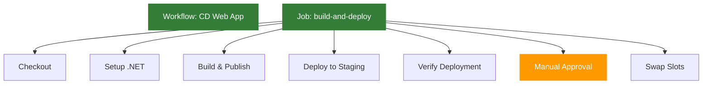

# Wdrażanie Aplikacji na Azure Web App z GitHub Actions

## Wymagania

- Konto na GitHub
- Konto Azure z aktywną subskrypcją
- Git zainstalowany lokalnie
- Azure CLI

## Cel

Celem jest zbudowanie pipeline'u w GitHub Actions, który automatycznie wdraża aplikację na Azure Web App z wykorzystaniem `deployment slots`.

Pipeline powinien spełniać następujące wymagania:
- Uruchamiać się przy commitach do `main`
- Budować aplikację i przygotowywać artefakt do wdrożenia
- Wdrażać aplikację do slotu "staging"
- Wykonywać walidację działania aplikacji
- Umożliwiać ręcznie zatwierdzenie przed przełączeniem na produkcję
- Wykonywać swap slotów (staging -> production)

## Krok 0 - Przygotowanie Infrastruktury

1. Postępuj zgodnie z instrukcją w dokumencie [README-infra.md](README-infra.md), aby utworzyć wymaganą infrastrukturę w Azure.

2. Po utworzeniu infrastruktury, dodaj slot deploymentu "staging" do Azure Web App:

```bash
az webapp deployment slot create \
  --name <nazwa-webapp> \
  --resource-group <nazwa-resource-group> \
  --slot staging
```

## Krok 1 - Konfiguracja Sekretów GitHub

1. Przejdź do swojego repozytorium na GitHub
2. Nawiguj do Settings > Secrets and variables > Actions
3. Dodaj nowe sekrety repozytorium:
   - `AZURE_CREDENTIALS`: Dane uwierzytelniające do Azure (uzyskane przez `az ad sp create-for-rbac` albo od prowadzącego):
      ```json
      {
        "clientSecret":  "xx",
        "subscriptionId":  "twoje-id-subskrypcji",
        "tenantId":  "32268039-35b0-4dc1-961a-989ebea1bcae",
        "clientId":  "yy"
      }
      ```
   - `AZURE_WEBAPP_NAME`: Nazwa twojej Azure Web App
   - `AZURE_RESOURCE_GROUP`: Nazwa grupy zasobów

## Krok 2 - Tworzenie Workflow

Utwórz nowy branch:

```bash
git checkout -b cd-webapp-deployment
```

Utwórz plik `.github/workflows/cd-webapp.yml` i postępuj zgodnie z poniższymi krokami.

### 2.1 Dodaj Trigger i Konfigurację Środowiska

```yaml
name: CD Web App Deployment

on:
  push:
    branches: [ main ]

env:
  AZURE_WEBAPP_NAME: ${{ secrets.AZURE_WEBAPP_NAME }}
  AZURE_WEBAPP_PACKAGE_PATH: './publish'
```

### 2.2 Dodaj Job Budowania i Wdrażania

```yaml
jobs:
  build:
    name: Build Application
    runs-on: ubuntu-latest
    steps:
      - name: Checkout code
        uses: actions/checkout@v4

      - name: Setup Node.js
        uses: actions/setup-node@v3
        with:
          node-version: '20'
          cache: 'npm'

      - name: Install Dependencies
        run: npm ci

      - name: Build Application
        run: npm run build
        
      - name: Get commit hash
        id: commit
        run: echo "sha_short=$(git rev-parse --short=8 HEAD)" >> $GITHUB_OUTPUT

      - name: Save commit hash
        run: echo ${{ steps.commit.outputs.sha_short }} > commit_hash.txt
        
      - name: Zip application
        run: zip -r weather-app-${{ steps.commit.outputs.sha_short }}.zip ./* -r

      - name: Upload temp artifact
        uses: actions/upload-artifact@v4
        with:
          name: commit-hash
          path: commit_hash.txt
          retention-days: 1
        
      - name: Upload app artifact
        uses: actions/upload-artifact@v4
        with:
          name: weather-app-${{ steps.commit.outputs.sha_short }}
          path: weather-app-${{ steps.commit.outputs.sha_short }}.zip
          retention-days: 1

  deploy-staging:
    name: Deploy to Staging
    needs: build
    runs-on: ubuntu-latest
    steps:
      - name: Download temp artifact
        uses: actions/download-artifact@v4
        with:
          name: commit-hash

      - name: Get commit hash
        id: commit
        run: cat commit_hash.txt >> $GITHUB_OUTPUT
      
      - name: Download app artifact
        uses: actions/download-artifact@v4
        with:
          name: weather-app-${{ steps.commit.outputs.sha_short }}
          
      - name: Extract app artifact
        run: unzip weather-app-${{ steps.commit.outputs.sha_short }}.zip -d ./app

      - name: Login to Azure
        uses: azure/login@v2
        with:
          creds: ${{ secrets.AZURE_CREDENTIALS }}

      - name: Deploy to staging slot
        uses: azure/webapps-deploy@v3
        with:
          app-name: ${{ env.AZURE_WEBAPP_NAME }}
          package: './app'
          slot-name: 'staging'

      - name: Verify deployment
        run: |
          sleep 30  # czekaj na start aplikacji
          STAGING_URL="https://${{ env.AZURE_WEBAPP_NAME }}-staging.azurewebsites.net"
          HTTP_STATUS=$(curl -s -o /dev/null -w "%{http_code}" $STAGING_URL)
          if [ $HTTP_STATUS -ne 200 ]; then
            echo "Deployment verification failed!"
            exit 1
          fi

  deploy-production:
    name: Deploy to Production
    needs: deploy-staging
    runs-on: ubuntu-latest
    steps:
      - name: Wait for approval
        uses: trstringer/manual-approval@v1
        with:
          secret: ${{ github.TOKEN }}
          approvers: ${{ github.actor }}
          minimum-approvals: 1
          message: 'Czy chcesz wdrożyć na produkcję?'

      - name: Login to Azure
        uses: azure/login@v2
        with:
          creds: ${{ secrets.AZURE_CREDENTIALS }}

      - name: Swap slots
        run: |
          az webapp deployment slot swap \
            --name ${{ env.AZURE_WEBAPP_NAME }} \
            --resource-group ${{ secrets.AZURE_RESOURCE_GROUP }} \
            --slot staging \
            --target-slot production
```

## Krok 3 - Testowanie Workflow

1. Wykonaj commit i push zmian:
```bash
git add .
git commit -m "Add Web App deployment workflow"
git push --set-upstream origin cd-webapp-deployment
```

2. Utwórz Pull Request i przeprowadź merge do main
3. Przejdź do zakładki Actions w GitHub, aby monitorować postęp wdrożenia
4. Po wdrożeniu do slotu staging, zweryfikuj działanie aplikacji
5. Zatwierdź wdrożenie na produkcję w interfejsie GitHub Actions

## Struktura Workflow



## Weryfikacja Wymagań

Upewnij się, że Twój workflow:
- [ ] Uruchamia się przy push do main
- [ ] Poprawnie buduje aplikację
- [ ] Wdraża na slot staging
- [ ] Weryfikuje działanie aplikacji
- [ ] Wymaga manualnej akceptacji
- [ ] Wykonuje swap slotów

## Najczęstsze Problemy

1. **Problem z uprawnieniami**: Upewnij się, że Service Principal ma odpowiednie uprawnienia do Web App
2. **Błędy budowania**: Sprawdź, czy wszystkie zależności są poprawnie zdefiniowane
3. **Timeout podczas weryfikacji**: Dostosuj czas oczekiwania na start aplikacji

## Dokumentacja

- [GitHub Actions](https://docs.github.com/en/actions)
- [Azure Web App Deployment](https://docs.microsoft.com/en-us/azure/app-service/deploy-github-actions)
- [Deployment Slots](https://docs.microsoft.com/en-us/azure/app-service/deploy-staging-slots)